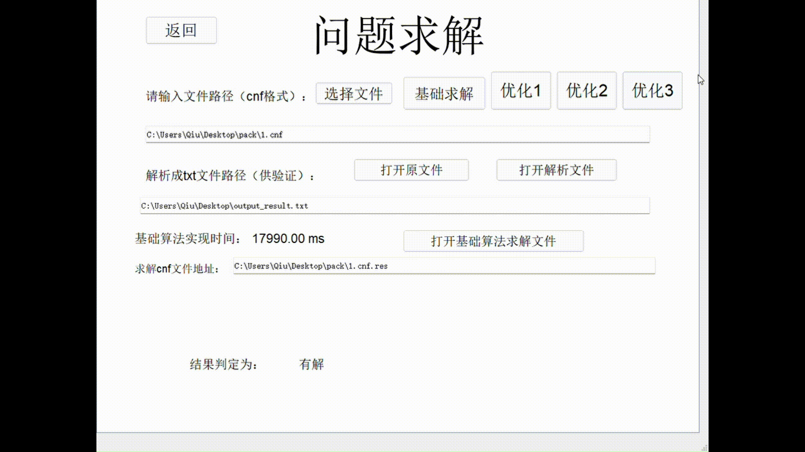
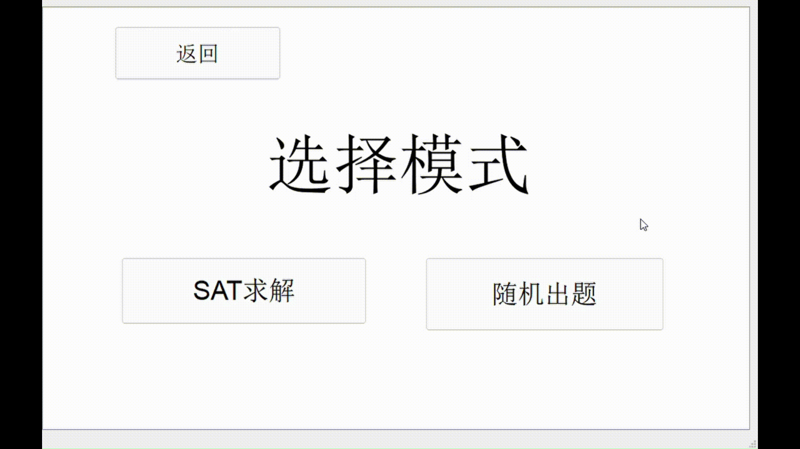
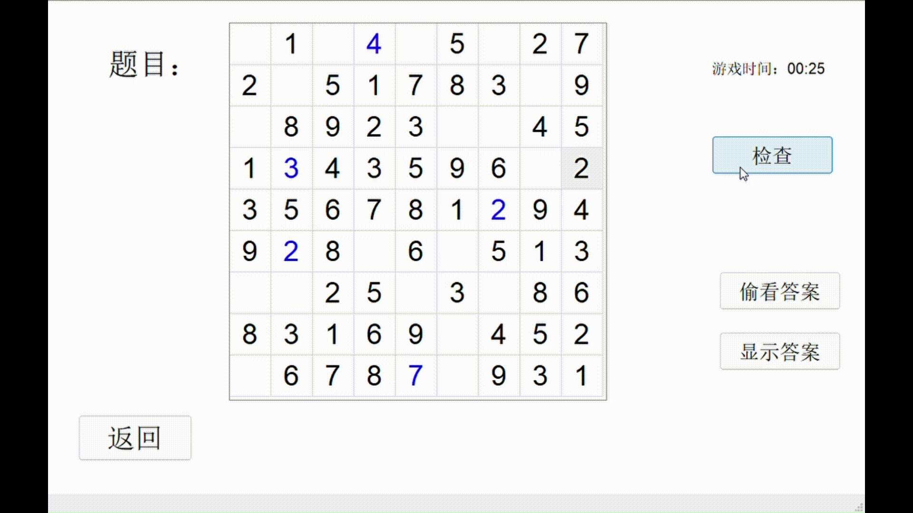
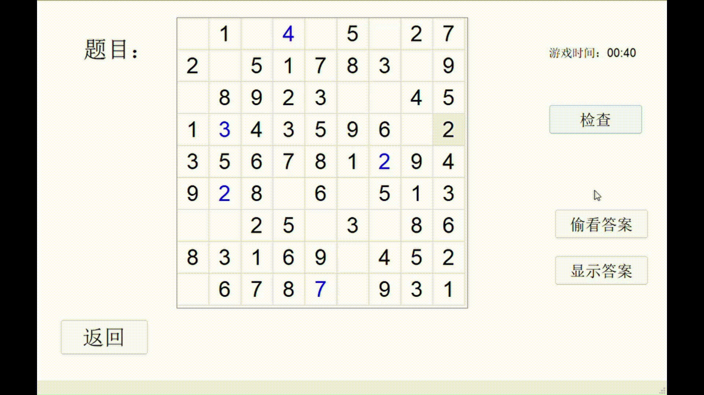
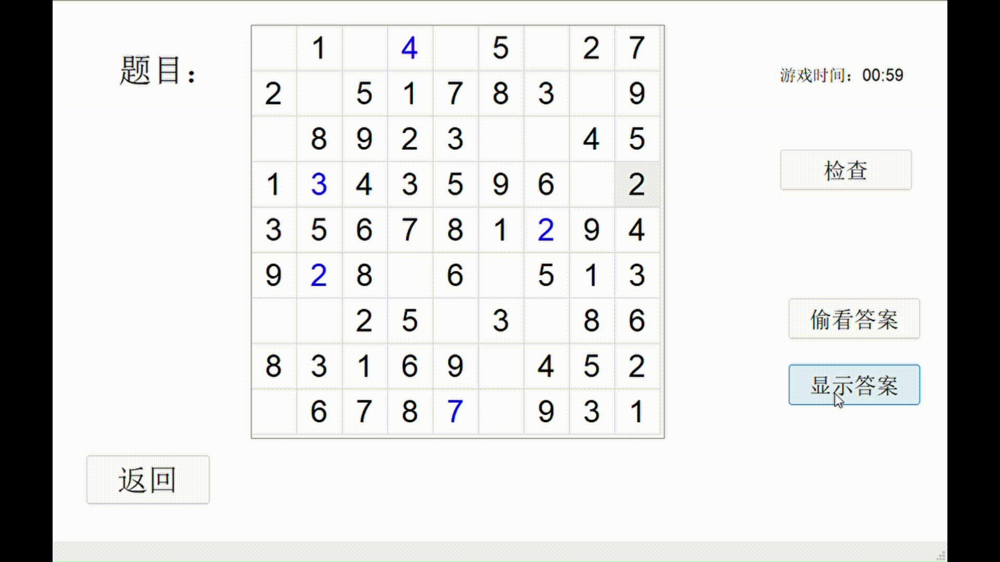

# 基于SAT的对角线数独游戏求解程序

## 简介课程设计
这是我完成的2024年秋季数据结构课设。课设使用PyQt5实现了界面设计，并成功设计了SAT问题的求解器（包含初始版本和优化版），同时完成了对角线数独问题的程序。验收时1-7算例能够用基础求解器解出，1-8、11能够用优化求解器解出。最后我用pyinstaller将所有相关文件打包生成X-sudoku程序。相关代码和文件均已经上传到github上:https://github.com/eclipseyes/HUST-CS-2024-Data-Structure-X-Sudoku。
 
 
## 操作指南

进入初始界面，点击“游戏规则”，可滚动查看规则文字。
 
 

在初始界面点击“开始游戏”，“SAT求解”，进入问题求解页面。
 
 

在问题求解界面点击“选择文件”，实际会弹出文件选择的窗口，类似于平时查找文件所在位置的方式，选择并确认即可。此后会更新并显示所选文件地址和生成的解析文件地址，通过点击“打开原文件”和“打开解析文件”两个按钮可以查看并比较原文件和解析文件是否一致（此处就不演示）。
 
 

点击“基础求解”，会调用最原始的DPLL实现的SAT求解器进行求解，此过程有可能耗时较长，遇到特定的算例也可能无法生成答案（此过程建议监控内存）。求解之后会显示出求解时间和求解文件地址，并给出是否有解的判定。
 
 

点击某一个优化求解策略进行求解，求解之后会显示出求解时间和求解文件地址，并给出相较于基础求解器时间上的优化率。
 
 

在“选择模式”界面，点击“随机出题”，在简单、基础、中级、专家四个难度（挖空数目不同）中选择一个难度，程序会随机初始化一个对角线数独题目并呈现出来。此时用户可以在空白格里通过输入数字进行解题。题目的数字将以黑色呈现且不可更改，而用户输入的数字将以蓝色呈现且是可改的。游戏时间将会实时显示。
 
 

点击“检查”，页面能够在题目下方显示一条消息，展现用户当前输入的数字中有错误的个数。该消息在5秒后消失。
 
 

点击“偷看答案”，页面能够呈现出答案格局。该格局将会在5秒后消失。
 
 

点击“显示答案”，答案格局将会展现出来，此时游戏时间固定显示，并显示出这局游戏中用户总共的偷看次数。
 
 
## 关于优化求解器的额外使用说明
对于DPLL算法，我仅从变元选择的逻辑上进行了不同方式的优化，以下是几种优化求解器的变元选择策略：
| 优化策略       | 方案1                         | 方案2               | 方案3                                |
|----------------|-------------------------------|---------------------|--------------------------------------|
| 变元选择逻辑   | 选择出现次数最多的变元         | 选择下一个变元      | 为所在子句较短的变元分配较大权重     |

对于不同的算例，选择的最佳优化策略不同。以下给出助教提供的算例包中算例编号对应的选择策略：
| 算例序号 | 优化策略 |
|----------|----------|
|     1    |     三    |
|     2    |     三    |
|     3    |     一    |
|     4    |     二    |
|     5    |     二    |
|     6    |     一    |
|     7    |     一    |
|     8    |     三    |
|     11   |     三    |

